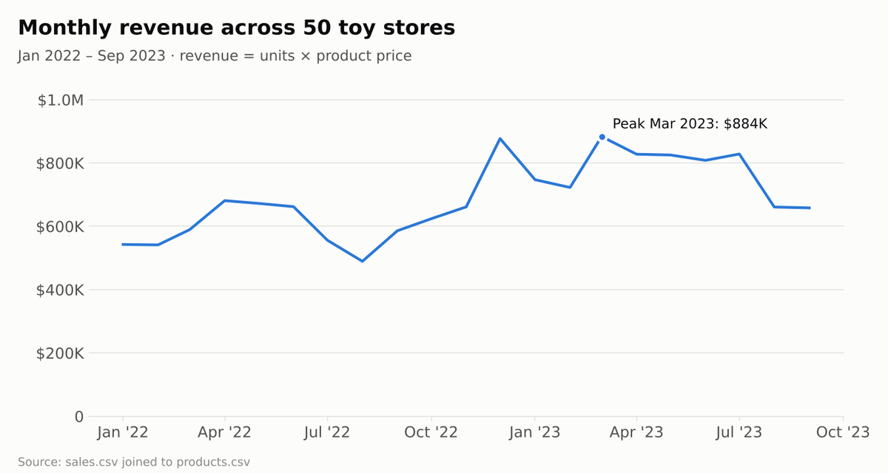
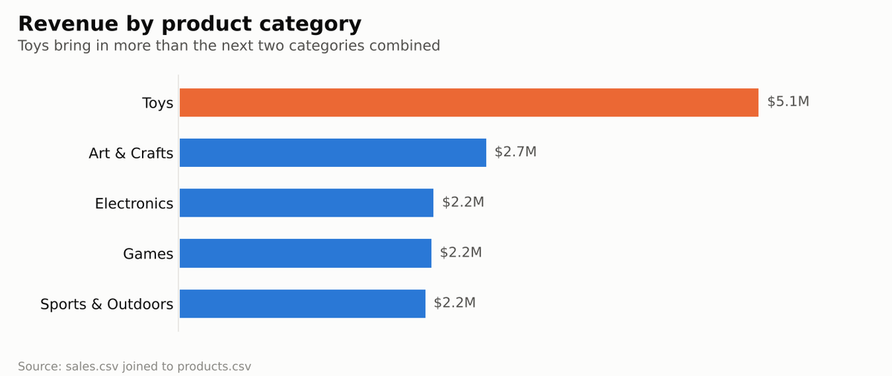

# 🧸 Toy Store KPI Report

**Retail Business Intelligence | Power BI • DAX • Python • Forecasting • Revenue & Profit KPIs**

A **Power BI** report tracking the key performance indicators of a toy store chain across 50 stores — orders, revenue and profit — with trends over time and breakdowns by product category.


## 🌐 Live Report

**[scarface96.github.io/Toy-Store-KPI-Report](https://scarface96.github.io/Toy-Store-KPI-Report/)**

The Power BI report is still here, and the same data now also drives a Python analysis that publishes an interactive web report, rebuilt by GitHub Actions on every push. No Power BI licence is needed to view it.

**What the Python analysis adds:**

- **Like-for-like growth:** Jan–Sep 2023 vs Jan–Sep 2022. Revenue grew **+31%** but profit only **+16%**.
- **Margin trend:** profit margin slid from **29.3%** (2022) to **26.2%** (2023) because the mix shifted to low-margin products.
- **Category drivers:** Art & Crafts more than tripled, while Electronics fell 28% (profit −39%).
- **Product portfolio map and ABC analysis:** 12 of 35 products earn 72% of profit; Colorbuds alone earns 21%, and its sales halved.
- **Store spread:** the median store grew +31%, three stores shrank.
- **Weekday × month heatmap:** Fridays and Saturdays nearly double a Monday; December lifts every day.
- **Q4 2023 forecast:** three methods compared in a six-month backtest; the most accurate is chosen and the seasonal view is shown alongside it.

## Business value

Bring sales, products and calendar data into an interactive retail performance report. KPI cards, category comparisons and time drill-down help stakeholders examine revenue, profitability and sales activity.

### Questions this project addresses

- How do revenue and profit change over time?
- Which product categories contribute the most sales?
- What happens to the KPIs when a category filter is applied?


## 📋 Overview

Management wants a single page that answers: *How much are we selling, how profitable is it, and which product categories drive the business?* This report brings together over **829,000 sales transactions** from January 2022 to September 2023 into one interactive view.

## 📈 Results at a Glance

Charts built with Python (pandas + matplotlib) from the data files in this repo.

<p align="center"></p>

<p align="center"></p>

## 🗂️ Data Model

Star schema with one fact table and three dimension tables:

| Table | Rows | Description |
|-------|------|-------------|
| `sales.csv` *(fact)* | 829,262 | Sale ID, date, store ID, product ID, units |
| `products.csv` | 35 | Product name, category, cost, price |
| `stores.csv` | 4 | Store location types: Airport, Commercial, Downtown, Residential |
| `calendar.csv` | 638 | Date table, 1 Jan 2022 – 30 Sep 2023 |

**Product categories:** Toys, Art & Crafts, Games, Sports & Outdoors, Electronics

## 📊 Report Page

- **3 KPI cards** — **Total Orders**, **Revenue (M)** and **Profit (M)**, each with a monthly trend
- **Clustered bar chart** — total orders by product category
- **Line chart** — revenue over time, with drill-down from month to week to day
- **Product category slicer** — filters the whole page

## 💡 Key Figures (from the data)

- **Total revenue:** ~$14.4M · **Total profit:** ~$4.0M · **Units sold:** ~1.09M
- **Toys** is by far the largest category (~$5.1M revenue), followed by Art & Crafts (~$2.7M)

## 📁 Repository Contents

```
├── analysis/
│   ├── data.py        # Loads the star schema, revenue/profit, like-for-like growth, ABC, stores, heatmap
│   ├── forecast.py    # Seasonal-naive, Holt and blended forecasts with a backtest
│   ├── report.py      # Turns the analysis into the interactive web page
│   └── build.py       # Runs everything and writes site/index.html
├── tests/             # pytest checks (totals match the Power BI report, growth windows, ABC, forecast)
├── .github/workflows/deploy.yml   # Test, build and publish to GitHub Pages
├── Toy Store KPI Report.pbix   # Power BI report
├── sales.csv, products.csv, stores.csv, calendar.csv
└── requirements.txt
```

## 🚀 How to Use

**Python report:**

```bash
pip install -r requirements.txt
python -m pytest            # run the tests
python -m analysis.build    # build site/index.html
```

**Power BI:** download `Toy Store KPI Report.pbix` and open it in **[Power BI Desktop](https://powerbi.microsoft.com/desktop/)** (free, Windows). The data is already loaded in the file.

## 🛠️ Skills Demonstrated

Data modelling (star schema) · DAX measures · KPI visuals · date hierarchies & drill-down · pandas · like-for-like growth analysis · ABC/Pareto analysis · time-series forecasting with backtesting · Plotly · automated deployment

---

👤 **Tony Mulunda** — [GitHub @Scarface96](https://github.com/Scarface96)

## Interpretation & limitations

Transaction count and units sold are different measures. Reconcile report totals with the source files before reuse, and verify the grain and keys of the store dimension before extending store-level analysis.

## Explore the analytics portfolio

- [sql_retail_sales_p1](https://github.com/Scarface96/sql_retail_sales_p1)
- [HR-Analysis-Dashboard](https://github.com/Scarface96/HR-Analysis-Dashboard)
- [Global-CO2-Emissions-Dashboard](https://github.com/Scarface96/Global-CO2-Emissions-Dashboard)
- [B2B-Sales-Pipeline-CRM-Dashboard-for-TechSolutions-Inc.](https://github.com/Scarface96/B2B-Sales-Pipeline-CRM-Dashboard-for-TechSolutions-Inc.)

## About This Project

A Power BI business-intelligence project designed to give retail stakeholders a concise view of orders, revenue and profitability. It demonstrates star-schema data modelling, DAX measures, KPI design, interactive filtering and management-focused dashboard storytelling.
